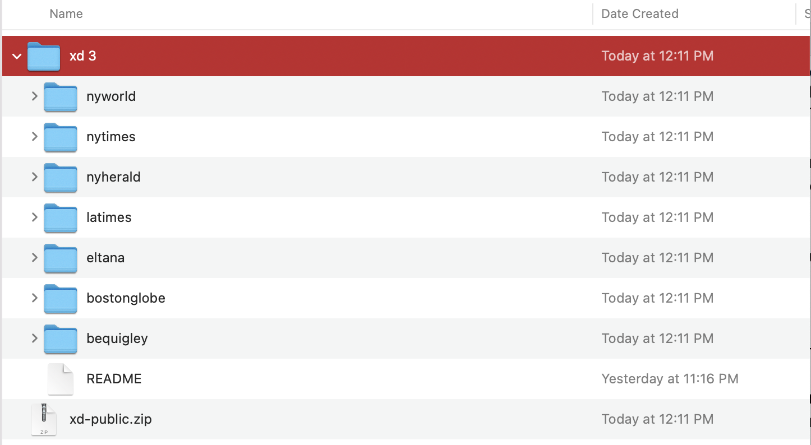
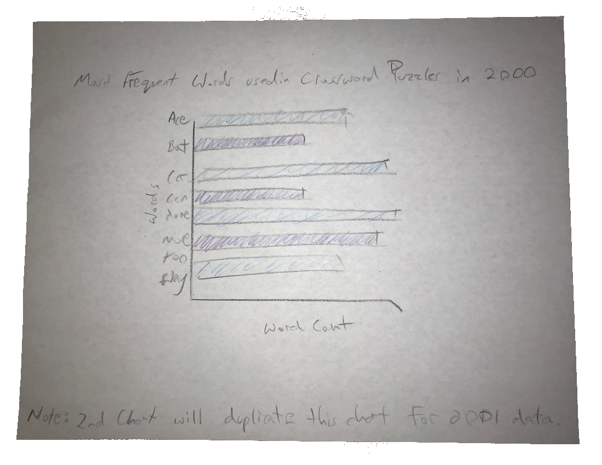
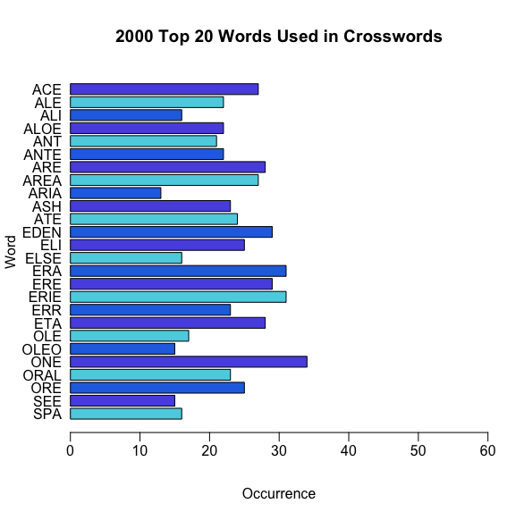
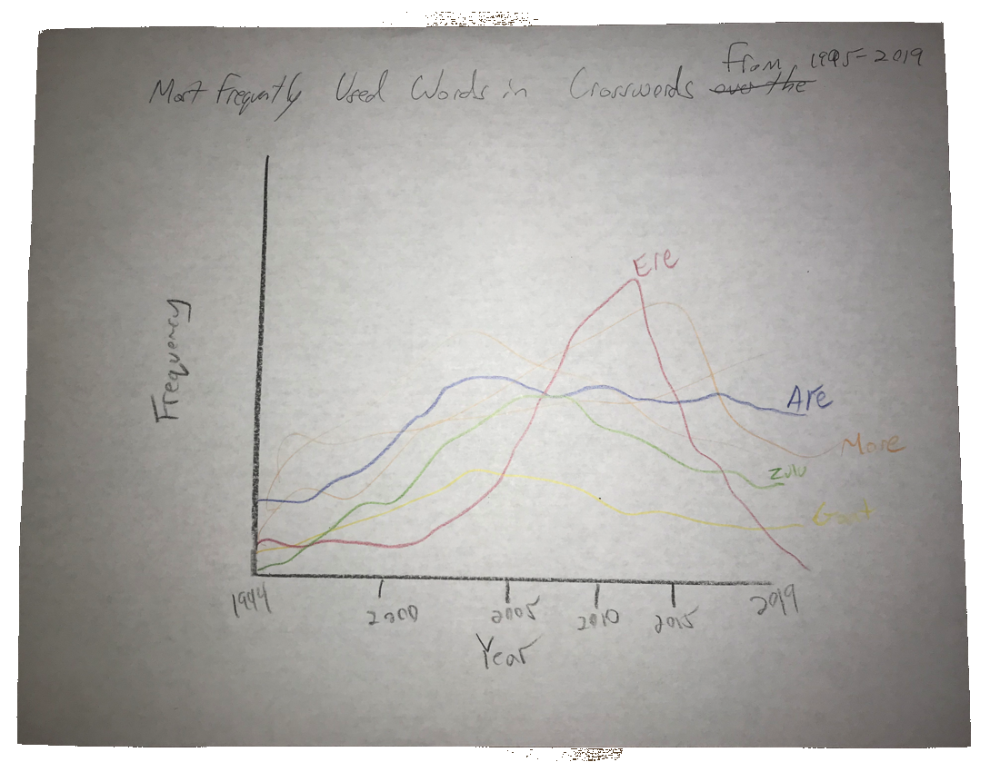
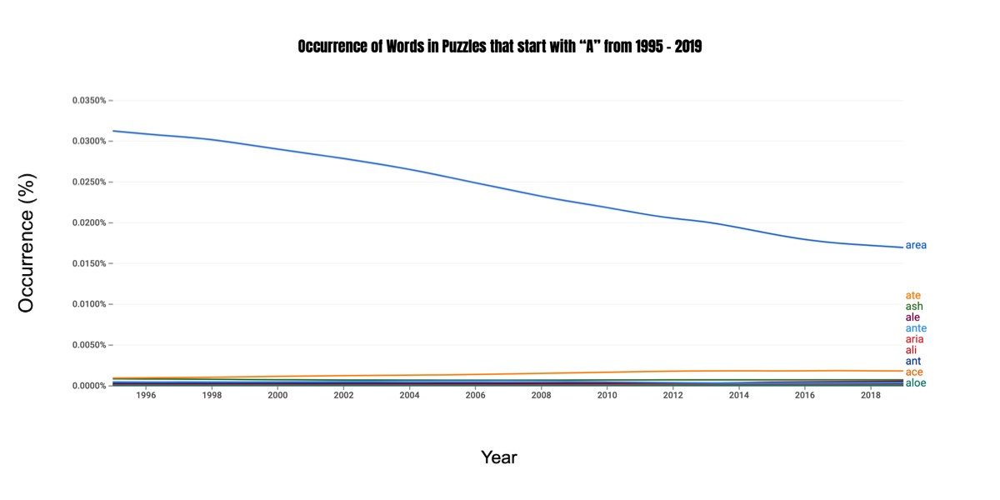
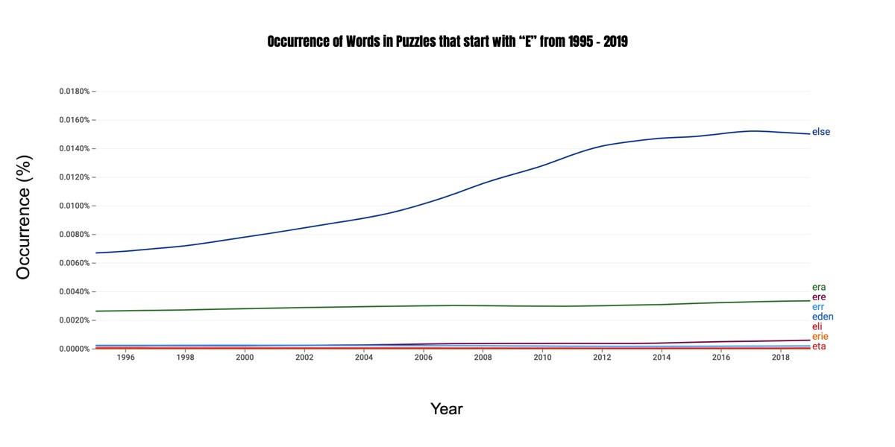
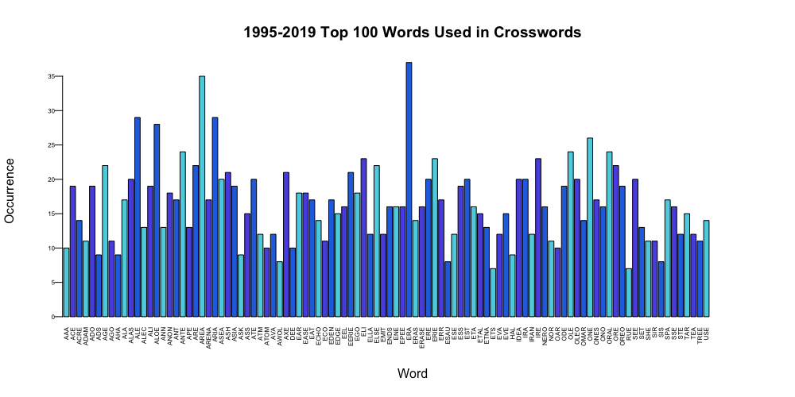

Homework 8: Fully Develop the Final Chart
================
Peter Mavronicolas
12/12/2021

### Brief description of datasets

The second data source link contains a combination of several datasets
from numerous news publishing companies containing clues and answers to
crossword puzzles. The second data source “clues.csv” already includes
the same data for columns “clues” and “answers” that were found in the
original dataset obtained from New York Times Crossword Puzzles.

### Second Data Source Link

    https://xd.saul.pw/data/

### Link to the Original Source of the Data

There is no cited link to the original source of data which is referred
to by the author as, “daily crosswords from several sources…” by the
author. Based on similar .zip files created by the author and the names
of those files and the data within them, the original sources were
Crossword Puzzles created by New York World, New York Times, New York
Herald, LA Times, Eltana, Boston Globe and B.E. Quigley.

### Questions

*Original Questions*

-   Why is the letter “X” used at a higher rate in the month of
    February?

-   Why is the letter “Q” used at a higher rate in the month of October?

After my initial analysis of the visualization idioms used to show the
occurrence of the letters “X” and “Q” by month, the data remained
relatively consistent with only one month as a slight exception. After
receiving valuable input from my Professor on the direction I should
take, I decided to gather data on the occurrence of specific words used
in Crossword Puzzles that had the greatest frequency by year. Since “X”
and“Q” were not included in the list of top twenty most frequently used
words, I decided to use the letters “A” and “E”. This lead me to my
final questions that

*Final Detailed Questions*

-   Which words that begin with the letter “A” or “E” occur most often
    in Crossword Puzzles in the year 2000?

-   What are the most frequently used words in Crossword Puzzles over
    the past 24 years that begin with the letter “A” or “E”?

-   What are the 100 most frequently used words in crossword puzzles in
    the past 24 years?

### Data Cleaning

The first step in cleaning the data in preparation for visualization is
to import the dataset into the project. I dragged the downloaded file
into the Project folder on my Desktop and began to read the data.

    CROSSWORD2 <- read.csv("clues.csv", stringsAsFactors = FALSE)

I continued to explore the “answers” column, filtered by the year 2000
and named the new dataset “CROSSWORD2.COMMON”.

    CROSSWORD2.COMMON <- CROSSWORD2$answer[CROSSWORD2$year==2000]

The dataset was then converted into a table by using the table()
function which returns a contingency table containing an array of
integers. Next, the data was pasted back into rows and columns using the
data.frame() function. The cells were then converted to characters.
Finally, the array was sorted in descending order.

    CROSSWORD2.TABLE[[1]] <- table(CROSSWORD2.COMMON)
    CROSSWORD2.TABLE[[1]] <- data.frame(CROSSWORD2.TABLE[[1]], stringsAsFactors = FALSE)
    CROSSWORD2.TABLE[[1]]$CROSSWORD2.COMMON <- as.character(CROSSWORD2.TABLE[[1]]$CROSSWORD2.COMMON)
    CROSSWORD2.TABLE[[1]] <- arrange(CROSSWORD2.TABLE[[1]], desc(Freq))

Limits were placed on the dataset in order to access the first 20 words
only.

    CROSSWORD2.COMMON.WORDS <- rbind(CROSSWORD2.TABLE[[1]][1:20,],CROSSWORD2.TABLE[[2]][1:20,])

The unique() function was used to remove duplicate elements and rows.

    WORDS <- unique(CROSSWORD2.COMMON.WORDS$CROSSWORD2.COMMON[CROSSWORD2.COMMON.WORDS$CROSSWORD2.COMMON!=""])

The data in the dataset was converted to the character type.

    WORDS <- as.character(WORDS)

*Horizontal Bar Chart I*

To visualize the horizontal bar chart, further cleaning is necessary.
First, the y-axis is set to “answers” and the x-axis is set to “year”.

    COMPOSITE.2000 <- CROSSWORD2$answer[CROSSWORD2$year==2000]
    COMPOSITE.2000 <- COMPOSITE.2000[COMPOSITE.2000 %in% WORDS]
    COMPOSITE.2000 <- table(COMPOSITE.2000)
    COMPOSITE.2000 <- data.frame(COMPOSITE.2000)
    COMPOSITE.2000$COMPOSITE.2000 <- as.character(COMPOSITE.2000$COMPOSITE.2000)
    COMPOSITE.2000 <- arrange(COMPOSITE.2000, desc(COMPOSITE.2000))

The final step in visualizing the horizontal bar chart is to use the
function barplot(), set the title (main), labels (xlab,ylab), bar colors
(col= c()) using hexadecimal. Finally, I adjusted the x-axis limits
(xlim) and the position of the x and y axis labels (mgp=c()).

    barplot(COMPOSITE.2000$Freq, las=1, horiz = TRUE, names.arg = COMPOSITE.2000$COMPOSITE.2000, col= c("#5BD1E2","#5B57E2","#2571E2"), 
    main="2000 Top 20 Words Used in Crosswords", horizontal=FALSE, xlab="Occurrence", ylab="Word", xlim=c(0,60), mgp=c(3,.5,0))

*Vertical Bar Chart*

Next, I extended the dataset to reflect the years 1995 to 2019 shown in
the parameters below.The remainder of the code is similar to the code
above that created the horizontal bar chart.

    COMPOSITE.2000 <- CROSSWORD2$answer[CROSSWORD2$year==1995:2019]
    COMPOSITE.2000 <- COMPOSITE.2000[COMPOSITE.2000 %in% WORDS]
    COMPOSITE.2000 <- table(COMPOSITE.2000)
    COMPOSITE.2000 <- data.frame(COMPOSITE.2000)
    COMPOSITE.2000$COMPOSITE.2000 <- as.character(COMPOSITE.2000$COMPOSITE.2000)

In order to reduce the size of the words on both x and y axis, I used
the par() function which modifies every piece of code that follows it.

    par(cex.axis=0.5)

I also changed “horizontal = FALSE” to “horizontal = TRUE”. This
tranposed both the x and y-axis so that the idiom is now landscaped
rather than viewed in portrait. I didn’t discover the need to transpose
the x and y-axis until creating the initial chart that, vertically,
would have taken up an entire page in the report.

    barplot(COMPOSITE.2000$Freq, las=1, horiz = FALSE, names.arg = COMPOSITE.2000$COMPOSITE.2000,     col= c("#5BD1E2","#5B57E2","#2571E2"), main="1995-2019 Top 100 Words Used in Crosswords", 
    ylab="Occurrence", xlab="Word", xlim=c(0,130), mgp=c(3,.5,0), las=2)

### Draft Chart I

### Refined Chart I

*Design Decisions Chart I*

I decided to place the words on the y-axis since they were easier to
read stacked. A Vertical bar chart fit better in the report as it took
up less vertical space on the page.

*Visualization Principles Applied: Chart I*

For Chart I, I chose to use a similar color saturation and the same
position on a common scale as it pertained to the occurrence of words in
the year 2000.

### Draft Chart II

### Refined Chart IIa

Subsets of the top 20 most frequently used words in Crossword Puzzles
was applied to Google’s NGram Generator which displays a timeline of
words used from 1995 to 2019. Words with the letter “A” are first
visualized.

### Refined Chart IIb

Next, all of the words beginning with the letter “E” were inputed into
the NGram generator.

*Design Decisions: Chart IIa and IIb*

The NGram Viewer limits the user from altering the idiom as it pertains
to the use of a line graph. I was able to input custom words which is
limited to 12 words. I was also able to change the range of years, the
language, case-sensitivity and smoothing.

*Visualization Principles Applied: Chart IIa and IIb*

Since I was using an automatically generated line graph in Google NGram
Viewer, I was unable to choose my own hue, luminance or idiom. This
brought me to develop Chart III which I was able to customize in R
Studio.

### Refined Chart III

*Design Decisions: Chart III*

For the 3rd and final chart, I thought it was important to give as many
words as possible for the crossword enthusiast to reference. I decided
to provide the top 100 most frequently used words in crossword puzzles
over the past 24 years. As much as I wanted to include the year 1994
which would round up the dataset to 25 years of data, the datasets
available did not contain the year 1994. I also decided to transpose the
axis from the previous chart where the words are transposed to the
x-axis. In order to fit the 100 words in a manageable view, I rotated
the tick marks (words) 90 degrees.

*Visualization Principles Applied: Chart III*

In Chart III, I used a similar color luminance that repeated every three
bins. I utilized a 2D area when choose a bar chart as my idiom. The tick
marks on the x-axis were angled 90 degrees in order to reduce the over
width of the idiom and a similar color luminance was applied every three
bars.

### Explanation

By constructing the above chart titled “1995-2019 Top 100 Words Used in
Crosswords”, I was able to answer all four questions asked in the “Final
Detailed Questions” section of this report. The most frequently used
words in the past 24 years that begin with the letters “A” and “E” are
identified by referencing Refined Chart III and starting from the left
side of the x-axis in alphabetical order. In summary, words that begin
with the letters “a”,“d”, “e”, “h”,“i”, “n”, “o”, “r”, “s”, “t” and “u”
are among the most frequently used. Ironically, the most common word
used in crossword puzzles over the past 24 years is the word “era” which
may have been intentional by the Cruciverbalists of popular news
publications.

### Final Thoughts

My development process always begins with the subject. In this case the
subject is crossword puzzles. Next I watch videos on the subject by
simply googling “crossword puzzles” in YouTube. Doing so helps me
develop ideas on what I’m searching for when it comes to data. Once I
have a rough idea of what datasets I’m searching for, I begin to explore
popular sites like Kaggle.com as well as doing a basic google search for
“crossword datasets”.

Development of what questions I was trying to answer from the datasets
continued throughout the process of manipulating the data in R Studio. I
would estimate that I spent a total of 16 hours for all three homework
assignments. I think it is important to mention that time spent on the
project is not indicative of how much effort a student put into the
project. If Homework 6,7 and 8 were assigned to me at the beginning of
the semester, I probably would have spent 25-30 hours completing all
three. My skills have improved a great deal while working with R Studio
since the beginning of the semester.

With regards to the Instructor’s choice of splitting the assignment up
into (3) separate homework’s, I would say an advantage to this format is
that it forces me to spend more time on one aspect of the assignment
such as developing the questions or manipulating the data. I would say
one disadvantage is that I found myself nearly completing the assignment
when I was working on homework 7. Realizing my mistake, I had to create
a new report.Rmd file for the final assignment and then pasted the
excess progress I made from Homework 7 into it. I would find splitting
the assignment into two parts as opposed to three would be more
effective for future classes.

### Reference

-   Download Crossword Data, <https://xd.saul.pw/data/>
-   Google Books Ngram Viewer, <https://books.google.com/ngrams/>
-   In R base plot, move axis label closer to axis,
    <https://stackoverflow.com/questions/30265728/in-r-base-plot-move-axis-label-closer-to-axis>
-   Table function,
    <https://www.rdocumentation.org/packages/base/versions/3.6.2/topics/table>
-   Unique Function,
    <https://www.rdocumentation.org/packages/base/versions/3.6.2/topics/unique>
-   Character Function,
    <https://www.rdocumentation.org/packages/base/versions/3.6.2/topics/character>
    How to transpose or say flip the x and y axis in R \[closed\],
    <https://stackoverflow.com/questions/43212916/how-to-transpose-or-say-flip-the-x-and-y-axis-in-r>
    Rotating x axis labels in R for barplot,
    <https://stackoverflow.com/questions/10286473/rotating-x-axis-labels-in-r-for-barplot>
    How to change font size of text and axes on R plots,
    <https://www.edureka.co/community/2000/how-to-change-font-size-of-text-and-axes-on-r-plots>
    R Function of the Day: par(cex.axis, cex.lab, cex.main, cex.sub),
    <http://rfunction.com/archives/2154>
